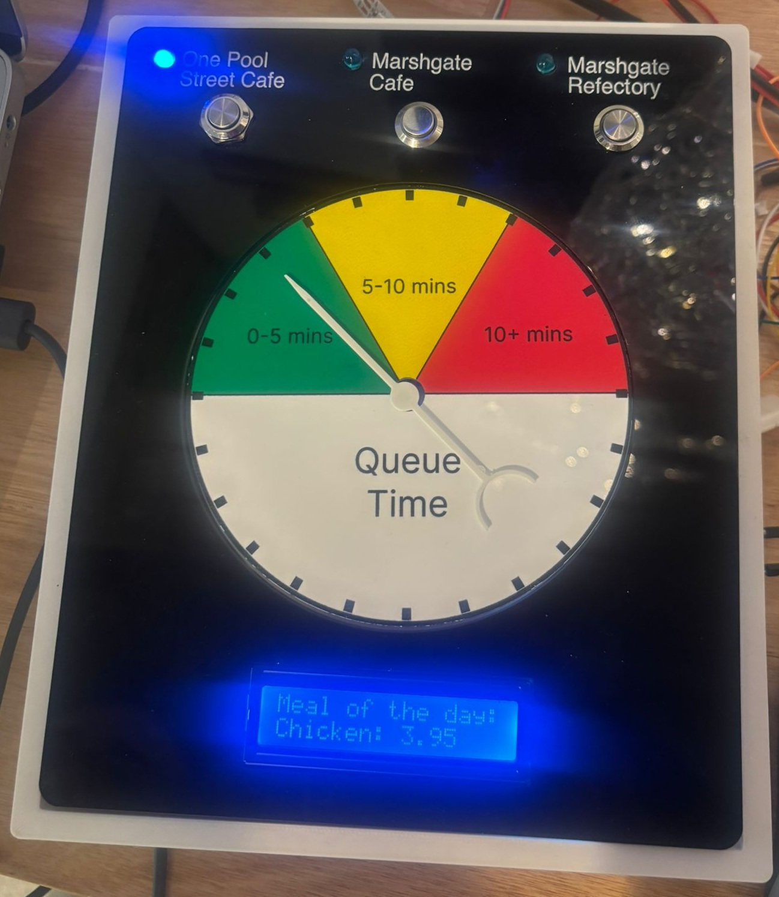

# Gauge and Go
"Gauge and Go" is a group project submission for CASA0019, Sensor Data Visualisation, as part of a Masters course at CASA, University College London.

Gauge and Go is a physical device that displays a simulated data feed of queue lengths at UCL East's three food venues in real time. It is accompanied by a digital twin: a 3D model contained in an AR smartphone app, displaying further details about queue length and food options.

📌 Project Overview
University campus users frequently face uncertainty when deciding where to eat during peak hours. At UCL East, dining locations such as Pool Street Café, Marshgate Café, and Marshgate Canteen offer varied menus, prices, and service speeds—but without a quick, data-driven way to compare queue times and value in real time.
Gauge & Grab addresses this challenge through a physical data device paired with a digital twin (AR + dashboard). Using a live (simulated) IoT data pipeline, the system visualises queue waiting times and daily specials to support fast, informed decisions—within 5 seconds of interaction.
Research Question

How can food-service data be presented in a fast, simple, and meaningful way to support informed decision-making on campus?

🎯 Project Aims & Objectives

Design a physical gauge that visualises live queue time at a glance

Develop a Unity-based digital twin (AR gauge + dashboards) driven by the same data

Demonstrate a real-time, end-to-end MQTT pipeline

Enable a dining decision in under 5 seconds

Explore how analogue and digital systems can work together in a smart-campus context

🧱 Physical Device Design
Aesthetic & Interaction
The gauge is inspired by familiar campus devices (e.g. thermostats, card readers) to encourage intuitive, brief interactions.
Key features

Laser-cut black acrylic front panel

White etched typography (Helvetica for legibility)

Magnetic mounting (inspired by prior CASA projects)

Minimalist black-and-white aesthetic

Each dining location includes:

A dedicated button

A corresponding LED

Clear etched labels for instant switching

Dial & Queue Representation
A servo-driven pointer rotates across a semi-circular dial with colour-coded zones:

Green (0–5 min) – acceptable

Yellow (5–10 min) – situational

Red (10+ min) – undesirable

Note: Due to fabrication constraints, final markers represent 75-second increments rather than 60 seconds.

Build Challenges

Dial height exceeded servo shaft length

3D-printed spacer reduced torque accuracy

Final demo used a paper prototype dial for clarity

These issues highlight the importance of earlier mechanical prototyping.

💻 Code & Device Logic
Embedded Platform
Built on Arduino / NodeMCU examples from Open-Gauges, supporting:

Wi-Fi connectivity

MQTT publish/subscribe

Servo motor control

LCD output

JSON parsing (ArduinoJson)

MQTT Topic Switching
The device dynamically switches between three MQTT topics (one per location):

Unsubscribes from the current topic

Updates topic index via button press

Subscribes directly to the selected location

This enables direct selection and improved usability.
Data Handling
Incoming JSON messages provide:

queue_time → mapped to servo position

Queue values are constrained to protect the physical dial limits.
LCD support for specials/prices is scaffolded but not fully deployed due to character limits.

📊 Data Design & Live MQTT System
Research-Informed Dataset
Data assumptions were grounded in:

On-site observations

Informal staff conversations at each café

Typical busy periods and service speed differences

Queue Time Model
A simple, transparent model prioritised clarity over realism:
queue_time = people_in_queue × service_factor

Service factors:

Pool Street Café → ×1

Marshgate Café → ×2

Marshgate Canteen → ×3

MQTT Architecture
Broker: Eclipse Mosquitto
Topic hierarchy
student/CASA0019/gauge&grab/
├── pool_street
├── marshgate_cafe
└── marshgate_canteen

Message payload

Location

People in queue

Queue time

Daily special

Price

Data is generated every 2 seconds via a Python script using DaBo-style publishing.
Verification
Validated using MQTT Explorer:

Correct topic structure

Live updates across all locations

Consistency between publisher, physical device, and digital twin

🧠 Digital Twin (Unity)
Purpose
The digital twin extends the physical gauge using AR and dashboards to visualise the same live data remotely.

AR gauge instantiated via Tap-to-Place

Gauge built as a prefab for control and reuse

UI bridge enables transition from gauge → dashboard

Each location dashboard includes:

Location name

Weekly specials table (image-based)

Line graph of weekly peak wait times

Navigation buttons between locations and views

Unity & MQTT Integration

Central MQTT Manager handles broker connection and subscriptions

MQTT Controller (Gauge) filters data by selected location and maps values to needle rotation

MQTT Weekly Chart Controller (Dashboard) aggregates data over time to render trends

Presentation Limitations

Live data integration completed on the day of presentation

Tap-to-Place issues prevented AR object display during demo

Future mitigation includes earlier end-to-end testing and pre-recorded fallback demos.

👥 Individual Contributions

Ethan Taylor – Physical device design, enclosure fabrication, dial graphics, servo integration, Arduino logic

Madina Diallo – Project coordination, dataset design, MQTT architecture, Python data generation, system integration, documentation

Yussr Osman Kamil Bashir – Research support, data structuring, testing, Unity dashboard development, system validation

🔍 Reflection
What Worked Well

Clear end-to-end data pipeline

Shared MQTT feed driving both physical and digital outputs

Intuitive, glanceable physical interface

Strong alignment between research, data, and design

Challenges

Simulated (dummy) data only

Simplified queue model

Late physical and AR testing

Mechanical constraints in final build

These trade-offs prioritised system architecture and real-time interaction.

🚀 Future Work

Replace 16-character LCD with OLED/TFT or symbolic LED indicators

Add AR-based user feedback button to compare lived experience vs estimates

Real queue detection (sensors or computer vision)

POS/menu system integration

Predictive queue modelling

Personalisation (dietary needs, budgets)

Mobile companion app

Staff-facing operational dashboard

✅ Conclusion
Gauge & Grab demonstrates how research-informed data, live MQTT messaging, and physical-digital visualisation can be combined into a coherent IoT system.
Starting from real café observations and staff insights, we built a structured dataset, automated it with Python, broadcast it live via MQTT, and connected both a physical gauge and an AR digital twin to the same data stream—delivering a complete, end-to-end IoT prototype for smart-campus decision-making.

📚 References
Aman, A. (2025) Hand adjusting a smart thermostat on a white wall. Vecteezy.
Cetools.org (2026a) 03: Dashboard and Real Time Data.
Cetools.org (2026b) 06: Unity AR Physical to Digital.
Eclipse Foundation (2024) paho.mqtt.python.
Eclipse Mosquitto (2025) MQTT: Lightweight messaging protocol.
Hudson-Smith, A. (2025) WindSpeedGauge.ino. Open-Gauges.
Letsa, L. (2017) ‘Assessing the Effect of Waiting Times on Restaurant Service Delivery’, European Business & Management, 3(6).
Low, E. et al. (2024) CASA0019: SubRadar.
Osborn, J.R. (2012) ‘Helvetica and the New York City Subway System’, Design and Culture, 4(1).
Python Software Foundation (2025) Python documentation.
Schiffler, A. (2025) How to use the Paho MQTT client in Python.
UCL Centre for Advanced Spatial Analysis (2025) DaBo: Data in a Box.
